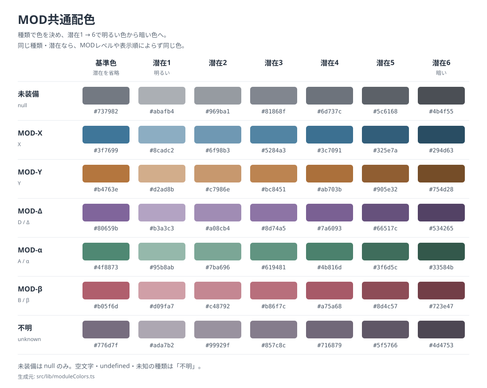

# MOD共通配色

このプロジェクトで、MODの種類や潜在を色で区別する表示を新規作成・修正するときに適用する。グラフの系列、凡例、表の色見本、画像出力で同じ対応を使う。ダメージ内訳など、MOD以外の意味を持つ色分けは対象外とする。

## 定義と見本

- [moduleColors.ts](../../src/lib/moduleColors.ts) を色値と潜在ごとの濃淡の唯一の定義元とする。ページごとにパレットや濃淡の計算を複製しない。
- [palette.svg](examples/palette.svg) は、共通コードから生成した基準色・潜在別の見本。実際の色値もこの見本で確認する。
- [generateModuleColorExample.mjs](../../scripts/generateModuleColorExample.mjs) が見本を生成する。色を変更したら、リポジトリルートで次のコマンドを実行して見本も更新する。

```sh
npm run generate:module-colors
```



## 色の意味

MODの種類で基準色を決め、潜在で明暗を変える。未装備は灰色、MOD-Xは青、MOD-Yは橙、MOD-Δは紫、MOD-αは緑、MOD-βは赤系とし、不明な種類には専用の色を使う。

- 潜在を省略した場合は基準色を返す。潜在を表現しない表示で使う。
- 潜在を指定した場合は、潜在1から6へ向かって明るい色から暗い色になる。各RGB成分を白または黒へ混ぜ、整数に丸める。基準色と混合係数は共通コードの `MODULE_BASE_COLORS` と `MODULE_POTENTIAL_SHADES` に定義する。
- 潜在1〜6以外の値、小数、`NaN`、無限大は潜在1として扱う。アプリ内の潜在が0始まりなら、呼び出す前に1〜6へ変換する。
- MODのレベル、系列の追加・削除、表示順や並べ替えでは色を変えない。同じ種類と潜在には常に同じ色を使う。
- 同色の系列を区別する必要がある場合は、線種、マーカー、ラベルを補助に使う。色だけに識別を任せない。
- 画面、保存ダイアログのプレビュー、実際のPNGでは同じ関数に同じ種類・潜在を渡す。

## 種類の表記と未装備

`getModuleColorKey` は種類をNFKCで正規化し、前後の空白を除去して大文字化する。種類のコードを渡し、`MOD-X` などの表示ラベルや名前全体は渡さない。

| 入力 | 共通キー |
| --- | --- |
| `null` | `none`（未装備） |
| `X`、`x`、全角の同表記 | `X` |
| `Y`、`y`、全角の同表記 | `Y` |
| `D`、`d`、`Δ`、`δ`、`∆` | `D` |
| `A`、`a`、`α`、`Α` | `A` |
| `B`、`b`、`β`、`Β` | `B` |
| `undefined`、空文字、空白のみ、その他の未知の種類 | `unknown`（不明） |

未装備を示す値は `null` だけとする。取得できなかった種類や未知の文字列を `null` へ置き換えない。共通キーは判定の結果であり、`none` という文字列を入力して未装備を表すことはできない。

## 使い方

```ts
import { getModuleColor, getModuleColorKey } from '../lib/moduleColors'

// MODの種類だけを表す見本。
const baseColor = getModuleColor('X')

// MOD-Δ・潜在3の系列。MODレベルや系列番号は渡さない。
const seriesColor = getModuleColor('Δ', 3)

// 未装備と不明な種類を別の状態として扱う。
const unequippedColor = getModuleColor(null, 1)
const unknownColor = getModuleColor(undefined, 1)
const moduleKey = getModuleColorKey('α') // 'A'
```

入力が実データのオブジェクトの場合は、未装備かどうかを先に判定し、装備中ならそのMODの種類コードを渡す。利用側で別の色変換を加えず、返された色を線、凡例、表の見本にそのまま使う。

MOD別のグラフ画像を作成・変更するときは、[グラフ画像出力のテンプレート](../chart-image/README.md)も読む。画像の配置・サイズはそちらの仕様で決め、MODの色はこの共通関数で決める。

## 適用範囲と変更時の確認

GGのパネル3「グラフ表示」のMOD別比較にこの共通配色を適用する。ダメージ内訳の積み上げ色は対象外。ほかの既存ページは、この仕様を追加しただけでは一括変更されない。今後、該当する表示を新規作成・修正するときにこの規則へ合わせる。

- 同じ種類・潜在が、系列順やMODレベルを変えても同じ色になることを確認する。
- 未装備、既知の種類、表記揺れ、不明な種類が意図した区分になることを確認する。
- 画面と実際に保存したPNGで、線と凡例の色が一致することを確認する。
- 共通コードの色や濃淡を変更した場合は、見本を再生成して全種類・全潜在を確認する。生成済みSVGを手作業で修正しない。
